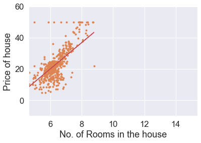

# Linear Regression implemented from scratch

Linear regression is one of the most basic and popular algorithms in machine learning. When any aspiring data scientist starts off in this field, linear regression is inevitably the first algorithm they come across. It’s intuitive, has a good range of uses, and is fairly straightforward to understand.

In this notebook, we will build a simple Univariate Linear Regression Model in Python from scratch to predict House Prices.

We will not be using **scikit-learn** for our model as we implement our model from scratch but we load our dataset from scikit-learn itself.